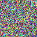
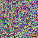
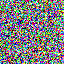
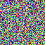
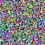
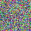
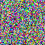
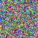
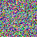

# Improved Denoised Diffusion Probabilistic Models
This is my implementation of [Improved Denoising Diffusion Probabilistic Models](https://arxiv.org/abs/2102.09672).
It also has an implementation of [Denoising Diffusion Implicit Models](https://arxiv.org/abs/2010.02502).

## Install
Install the environment with conda, then:

```
pip install -r requirements.txt --extra-index-url https://download.pytorch.org/whl/cu116
```

We do this because conda's environment.yml cannot specify extra arguments to pip.

## Training Statistics
### Commit 052985162b85ebf28903c79dc781703507ae99e3
| Device    | Batch Size | ba/s | samples/s |
|-----------|------------|------|-----------|
| A100-80GB | 302        | 1.00 | 300       |
| A100-80GB | 128        | 2.12 | 271.36    |

## Samples
<p float="left">
  
  
  
  
  
  
  
  
  
  
</p>

Trained on CelebHQ for 36000 batches with batch size of 302.
Loss of 0.02573 with $L_\text{simple}$ objective.

## Features
Implemented:
- [x] $L_\text{simple}$ objective
- [x] Cosine schedule
- [x] Training + Generating
- [x] $L_\text{hybrid}$ objective / learned variance
  - TODO: Verify sample quality
- [x] Faster sampling
- [x] Sampling from DDIM

Unplanned:
- [ ] $L_\text{vlb}$ objective with loss-aware sampler

## Repository Guide
This repository is *super* messy. It has a lot of scratch files that represent my attempts at figuring things out / debugging escapades. Nevertheless, here's the overview:
- `openai-ddm/` contains a forked version of [improved-diffusion](https://github.com/openai/improved-diffusion). I spent a while stripping out features (fp16, checkpointing) to get to the bare-minimum training loop.
- All training is done using [composer](https://github.com/mosaicml/composer) which supports fp16, checkpointing, automatic wandb logging, etc.
- `tests/` has some tests that verify my UNet / diffusion is identical to OpenAI's unet/diffusion
    - I haven't written tests for sampling yet
- [run_unet.py](./run_unet.py) prints out the architecture of the UNet in a friendly form & verifies the UNet works
- [make_torchdata.py](./data_scripts/make_torchdata.py) contains a script to generate a dataset from a folder of image files. It outputs parquet files.

## Why?
This repository is for my personal use. But, there are a few nice things you might get from it:
- The diffusion code is written simply w/o support for a ton of different options in a single class so it's easy to understand
- Same goes for the UNet
- (TODO), I will port some comments from my ml-experiments repository to the UNet, so you can see why certain things are done
- Usage of MosaicML's trainer means you don't get bogged down by FP16/checkpointing/logging & can focus on the important stuff

## Credit
- The "losses.py" and "nn.py" file inside of the "diffusion" folder are copy-pasted from the OpenAI codebase. I haven't had time to re-implement them yet. 
- The `for_timesteps` function is heavily based off of a function in lucidrain's imagen-pytorch repository.
